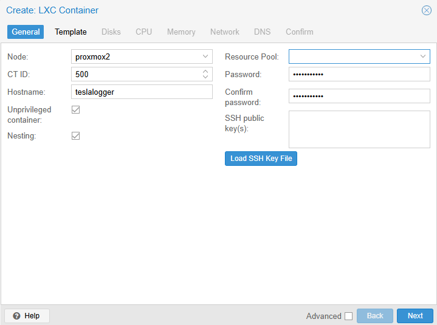
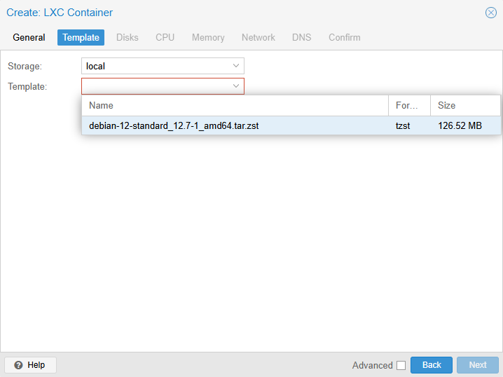
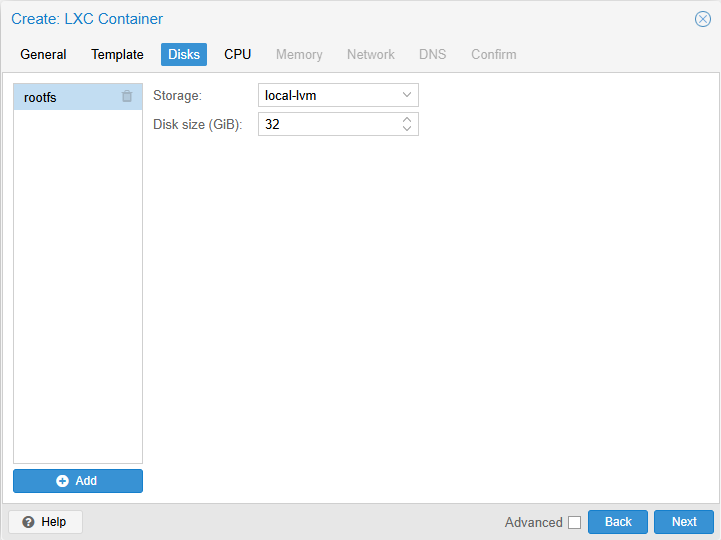
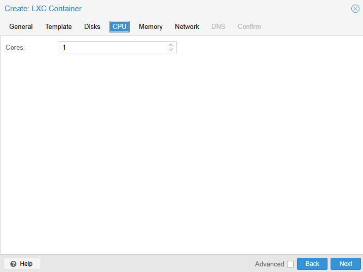
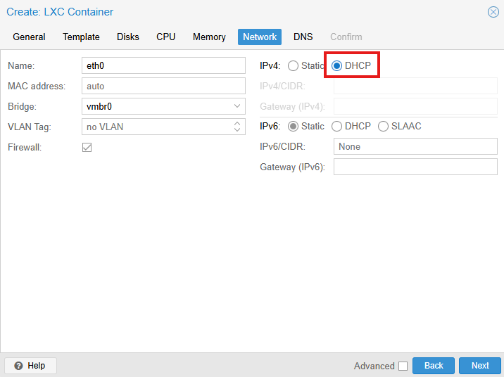
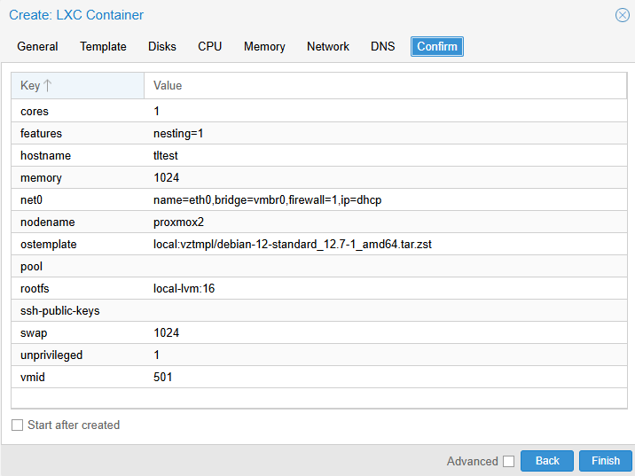
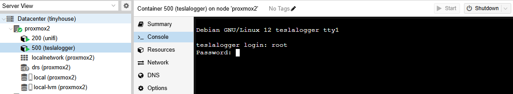

# TeslaLogger Installation Script
(work in progress)

## Run Script
```
wget https://raw.githubusercontent.com/Adminius/tlinstall/refs/heads/main/tlinstall.sh
sh tlinstall.sh
```

## Install in Proxmox LCX

Create new CT:















and than run installation script (see above)
